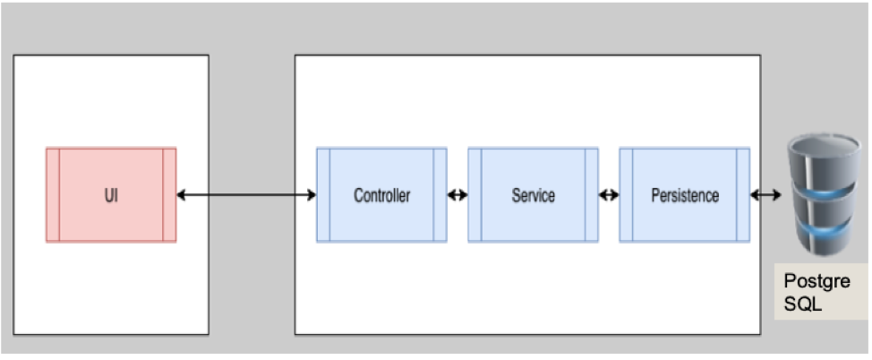
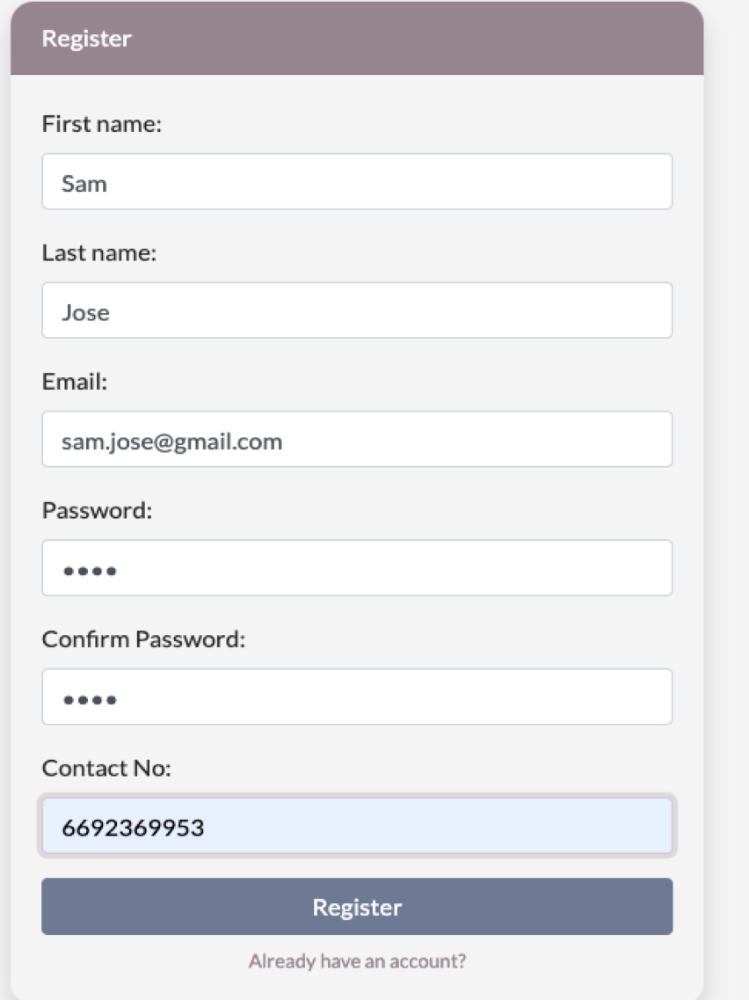
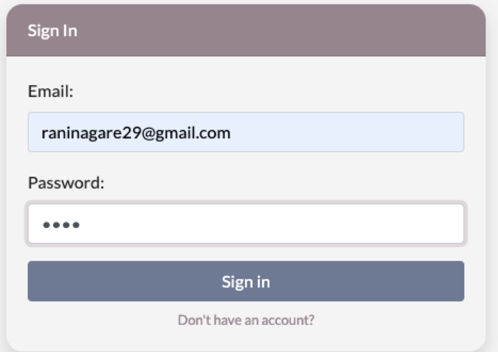
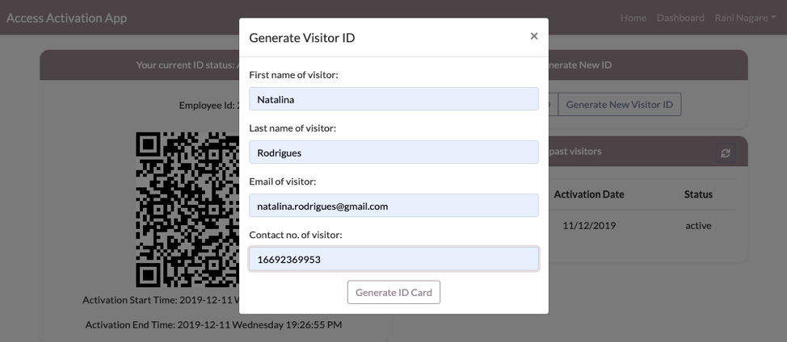

# Corporate Access Card Activation App

In today’s Corporate world, an employee of the company will be given an ID and Access card to use company resources. These resources include access to the company’s main entrance, meeting rooms, printers and so on. 

A lot of times, the employee forgets to bring their access card at work, causing them to issue a temporary access card at the reception. The process of issuing a temporary access card is a time consuming, and it needs supervision from someone who works at the help desk of the company. 

The goal of this project is to self-serve the process of temporary access card activation using a web app that is pre-authenticated with the company’s network. 

## System Architecture

User can register and login to the system. Then user can generate the temporary access card that will be valid for 8 hours.For critical company resource aceess I have added extra level of security by adding face recognition to the system. Upon successfull face recognition user will granted access to the resource.

## Steps to Setup
** 1. Clone the application repo **

** 2. Build and run the backend app AccessIdServerApplication using maven without packaging it. 

mvn spring-boot:run
The backend server will start at http://localhost:8080.

** 3. Start frontend application(React JS)

In the project directory, you can run:

### `yarn build`
### `yarn install`
### `yarn start`

It will open the app view in the browser at
[http://localhost:3000]

## Functionality.

### 1. User Registration

### 2. User Login

### 3. Generate Id for User

### 4. Generate Id for Visitor

### 5. Validation using face recognition

